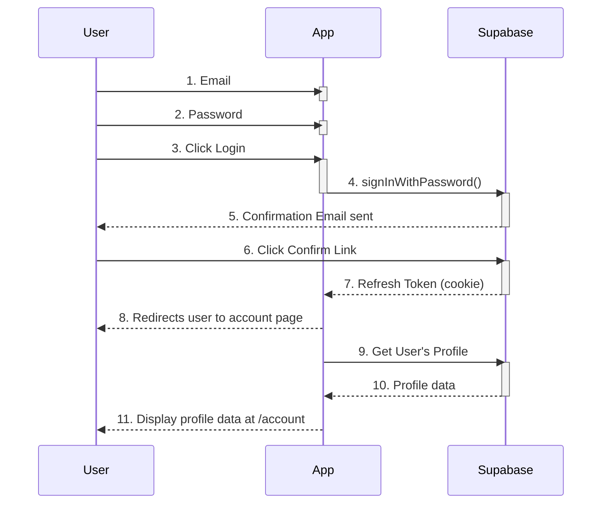

# User Authentication Flowd

Project Supernova uses **Supabase** for Authentication.

## Login Flow

```mermaid
sequenceDiagram
  participant U as User
  participant A as App
  participant S as Supabase

  U ->> A: 1. Email
  activate A
  deactivate A
  U ->> A: 2. Password
  activate A
  deactivate A
  U ->> A: 3. Click Login
  activate A
  A ->> S: 4. signInWithPassword()
  deactivate A
  activate S
  S -->> U: 5. Confirmation Email sent
  deactivate S
  U ->> S: 6. Click Confirm Link
  activate S
  S -->> A: 7. Refresh Token (cookie)
  deactivate S
  A -->> U: 8. Redirects user to account page
  A ->> S: 9. Get User's Profile
  activate S
  S -->> A: 10. Profile data
  deactivate S
  A -->> U: 11. Display profile data at /account
```
